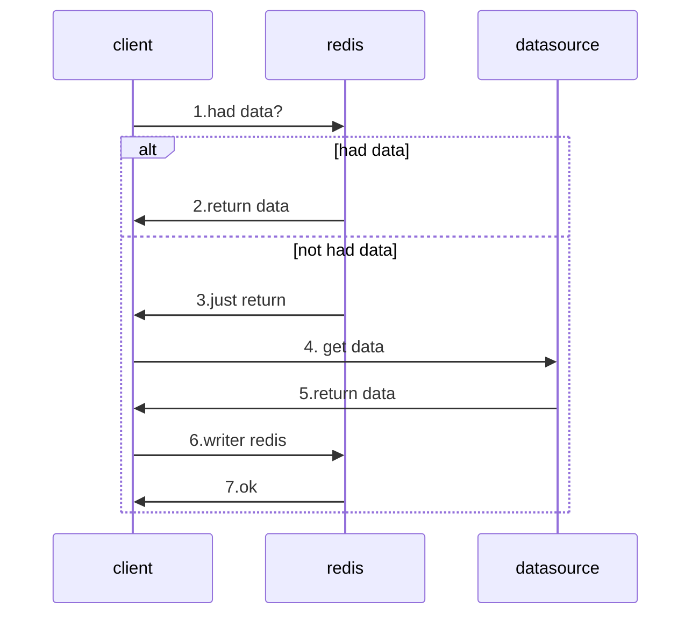
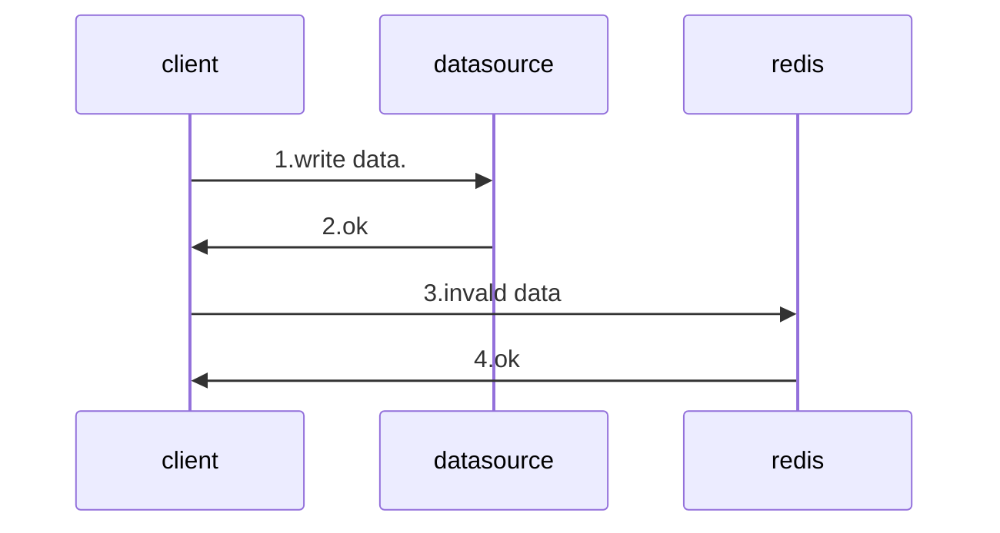

Redis remote dictionary service(远程字典表服务)
一个远程的缓存
缓存都是易失的
缓存的持久化方式
RDB: 基于时间与手动快照
AOF: 基于命令 append only file
缓存都有时间
过期策略有：
1. 定时删除
2. 惰性删除
3. 定期删除
Redis的过期删除策略就是：惰性删除和定期删除两种策略配合使用。
缓存过期时间
缓存都有大小限制
淘汰策略
不过期：no eviction
all keys lru
all key random
volatile key lru 
volatile lru
volatile ttl 

Redis 问题?
缓存过期策略
缓存淘汰策略
缓存雪崩
描述：所有key在同一时间内消失.
fix：在一个时间范围内 加随机函数.
缓存穿透
描述：查询不存在的key导致所有的请求都打到数据库.
fix：把所有的数据存到 `布隆过滤器` 上
次要 fix: 缓存不存在的key

缓存更新的策略：
Cache aside pattern

##### 读：
先读缓存,在读数据库
    1. 缓存存在返回 
    2. 缓存没读到
        1. 读数据库
        2. 写入缓存
##### 写：
先写数据库,再让缓存失效
    1. 先写数据库
    2. 让缓存失效
Cache aside pattern
能够行的通的原因是
    1.读数据库比写数据库快
    也就是 
    读.2
    比
    写.1
    快
    
    
Redis集群方式?