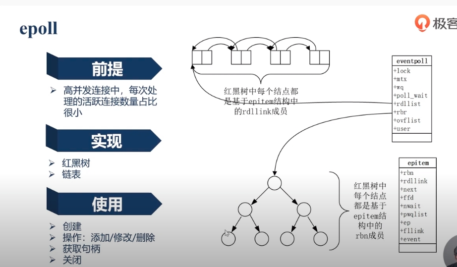

### netty的好处
- 它的基于 Java NIO 的异步的和事件驱动的实现,保证了高负载下应用程序
性能的最大化和可伸缩性
- Netty 也包含了一组设计模式,将应用程序逻辑从网络层解耦,
  简化了开发过程,同时也最大限度地提高了可测试性、模块化以及代码的可重用性。
  
#### Netty 抽象
- Channel — Socket 
- EventLoop —控制流、多线程处理、并发;
- ChannelFuture —异步通知。

##### ChannelPipeline 是什么 ?
    - ChannelPipeline  提供了 ChannelHandler 链的容器
##### ChannelHandler 是什么 ?
  
 > ChannelHandler 安装到 ChannelPipeline 中的过程如下所示:
  一个 ChannelInitializer 的实现被注册到了 ServerBootstrap 中 1 ;
  当 ChannelInitializer.initChannel() 方法被调用时, ChannelInitializer
  将在 ChannelPipeline 中安装一组自定义的 ChannelHandler ;
  ChannelInitializer
  将它自己从 ChannelPipeline 中移除。
#####什么是边缘触发 
- man epoll
  [epoll1](https://blog.csdn.net/Eunice_fan1207/article/details/99641348)
  [epoll2](https://blog.csdn.net/Eunice_fan1207/article/details/99674021)
```shell
EPOLL(7)                   Linux Programmer's Manual                  EPOLL(7)

NAME
       epoll - I/O event notification facility

SYNOPSIS
       #include <sys/epoll.h>

DESCRIPTION
       The  epoll  API performs a similar task to poll(2): monitoring multiple
       epoll API表现的跟poll一样，监听多个文件描述符看他们的IO是否准备好，
       file descriptors to see if I/O is possible on any of them.   
        The  epoll API can be used either as an edge-triggered or a level-triggered inter‐
       epoll API能够被用来边缘触发与水平出触发的接口，并可以很好的观察大批量的文件描述符
       face and scales well to large numbers of watched file descriptors.  
       The following  system  calls  are  provided  to  create and manage an epoll
       以下的系统调用可以提供创建与管理 epoll的实例 
       instance:

       *  epoll_create(2) creates a new epoll  instance  and  returns  a  file
          epoll_create(2) 
          descriptor  referring to that instance.
            epoll_create（2）创建一个新的epoll实例，并返回引用该实例的文件epoll_create（2）描述符。
          (The more recent epoll_cre‐
          ate1(2) extends the functionality of epoll_create(2).)

       *  Interest in particular  file  descriptors  is  then  registered  via
          然后通过epoll_ctl（2）注册对特定文件描述符的关注。当前在epoll实例上注册的文件描述符集有时称为epoll集。
          epoll_ctl(2).   The  set of file descriptors currently registered on
          an epoll instance is sometimes called an epoll set.

       *  epoll_wait(2) waits for I/O events, blocking the calling  thread  if
          no events are currently available.
            epoll_wait（2）等待I / O事件，如果当前没有可用的事件，则阻塞调用线程。
   Level-triggered and edge-triggered
       The  epoll event distribution interface is able to behave both as edge-
       triggered (ET) and as level-triggered (LT).  The difference between the
       two mechanisms can be described as follows.  Suppose that this scenario
       happens:
       假设有以下场景:
       1. The file descriptor that represents the read side of a pipe (rfd) is
          registered on the epoll instance.
       
       2. A pipe writer writes 2 kB of data on the write side of the pipe.

       3. A call to epoll_wait(2) is done that will return rfd as a ready file
          descriptor.

       4. The pipe reader reads 1 kB of data from rfd.

       5. A call to epoll_wait(2) is done.

       If the rfd file descriptor has been added to the epoll interface  using
       the  EPOLLET  (edge-triggered)  flag, the call to epoll_wait(2) done in
       step 5 will probably hang despite the available data still  present  in
       the  file  input buffer; meanwhile the remote peer might be expecting a
       response based on the data it already sent.  The  reason  for  this  is
       that edge-triggered mode delivers events only when changes occur on the
       monitored file descriptor.  So, in step 5 the caller might end up wait‐
       ing  for some data that is already present inside the input buffer.  In
       the above example, an event on rfd will be  generated  because  of  the
       write  done in 2 and the event is consumed in 3.  Since the read opera‐
       tion done in 4 does not consume the whole  buffer  data,  the  call  to
       epoll_wait(2) done in step 5 might block indefinitely.

       An  application  that  employs  the EPOLLET flag should use nonblocking
       file descriptors to avoid having a blocking read or write starve a task
       that  is  handling multiple file descriptors.  The suggested way to use
       epoll as an edge-triggered (EPOLLET) interface is as follows:

              i   with nonblocking file descriptors; and

              ii  by waiting for an  event  only  after  read(2)  or  write(2)
                  return EAGAIN.

       By  contrast,  when  used  as a level-triggered interface (the default,
       when EPOLLET is not specified), epoll is simply a faster  poll(2),  and
       can be used wherever the latter is used since it shares the same seman‐
       tics.

       Since even with edge-triggered epoll, multiple events can be  generated
       upon  receipt  of multiple chunks of data, the caller has the option to
       specify the EPOLLONESHOT flag, to tell epoll to disable the  associated
       file descriptor after the receipt of an event with epoll_wait(2).  When
       the EPOLLONESHOT flag is specified, it is the  caller's  responsibility
       to rearm the file descriptor using epoll_ctl(2) with EPOLL_CTL_MOD.

   Interaction with autosleep
       If  the  system  is  in  autosleep mode via /sys/power/autosleep and an
       event happens which wakes the device from sleep, the device driver will
       keep  the  device  awake  only until that event is queued.  To keep the
       device awake until the event has been processed, it is necessary to use
       the epoll_ctl(2) EPOLLWAKEUP flag.

       When  the  EPOLLWAKEUP  flag  is  set  in the events field for a struct
       epoll_event, the system will be kept awake from the moment the event is
       queued,  through  the  epoll_wait(2) call which returns the event until
       the subsequent epoll_wait(2) call.  If the event should keep the system
       awake  beyond  that  time,  then  a  separate wake_lock should be taken
       before the second epoll_wait(2) call.

   /proc interfaces
       The following interfaces can be used to limit the amount of kernel mem‐
       ory consumed by epoll:

       /proc/sys/fs/epoll/max_user_watches (since Linux 2.6.28)
              This  specifies  a limit on the total number of file descriptors
              that a user can register across all epoll instances on the  sys‐
              tem.   The  limit  is  per  real  user ID.  Each registered file
              descriptor costs roughly  90  bytes  on  a  32-bit  kernel,  and
              roughly  160  bytes  on a 64-bit kernel.  Currently, the default
              value for max_user_watches is 1/25 (4%)  of  the  available  low
              memory, divided by the registration cost in bytes.

   Example for suggested usage
       While  the  usage of epoll when employed as a level-triggered interface
       does have the same  semantics  as  poll(2),  the  edge-triggered  usage
       requires  more  clarification  to avoid stalls in the application event
       loop.  In this example, listener is a nonblocking socket on which  lis‐
       ten(2)  has  been  called.  The function do_use_fd() uses the new ready
       file descriptor until EAGAIN is returned by either read(2) or write(2).
       An event-driven state machine application should, after having received
       EAGAIN,  record  its  current  state  so  that  at  the  next  call  to
       do_use_fd()  it  will  continue  to  read(2)  or write(2) from where it
       stopped before.

           #define MAX_EVENTS 10
           struct epoll_event ev, events[MAX_EVENTS];
           int listen_sock, conn_sock, nfds, epollfd;

           /* Code to set up listening socket, 'listen_sock',
              (socket(), bind(), listen()) omitted */

           epollfd = epoll_create1(0);
           if (epollfd == -1) {
               perror("epoll_create1");
               exit(EXIT_FAILURE);
           }

           ev.events = EPOLLIN;
           ev.data.fd = listen_sock;
           if (epoll_ctl(epollfd, EPOLL_CTL_ADD, listen_sock, &ev) == -1) {
               perror("epoll_ctl: listen_sock");
               exit(EXIT_FAILURE);
           }

           for (;;) {
               nfds = epoll_wait(epollfd, events, MAX_EVENTS, -1);
               if (nfds == -1) {
                   perror("epoll_wait");
                   exit(EXIT_FAILURE);
               }

               for (n = 0; n < nfds; ++n) {
                   if (events[n].data.fd == listen_sock) {
                       conn_sock = accept(listen_sock,
                                          (struct sockaddr *) &addr, &addrlen);
                       if (conn_sock == -1) {
                           perror("accept");
                           exit(EXIT_FAILURE);
                       }
                       setnonblocking(conn_sock);
                       ev.events = EPOLLIN | EPOLLET;
                       ev.data.fd = conn_sock;
                       if (epoll_ctl(epollfd, EPOLL_CTL_ADD, conn_sock,
                                   &ev) == -1) {
                           perror("epoll_ctl: conn_sock");
                           exit(EXIT_FAILURE);
                       }
                   } else {
                       do_use_fd(events[n].data.fd);
                   }
               }
           }

       When used as an edge-triggered interface, for performance  reasons,  it
       is  possible  to  add  the  file  descriptor inside the epoll interface
       (EPOLL_CTL_ADD) once by specifying (EPOLLIN|EPOLLOUT).  This allows you
       to  avoid  continuously  switching between EPOLLIN and EPOLLOUT calling
       epoll_ctl(2) with EPOLL_CTL_MOD.

   Questions and answers
       Q0  What is the key used to distinguish the file descriptors registered
           in an epoll set?

       A0  The  key  is  the combination of the file descriptor number and the
           open file description (also known as an  "open  file  handle",  the
           kernel's internal representation of an open file).

       Q1  What  happens  if you register the same file descriptor on an epoll
           instance twice?

       A1  You will probably get EEXIST.  However, it is  possible  to  add  a
           duplicate  (dup(2),  dup2(2),  fcntl(2) F_DUPFD) file descriptor to
           the same epoll instance.  This can be a useful technique  for  fil‐
           tering  events,  if  the  duplicate file descriptors are registered
           with different events masks.

       Q2  Can two epoll instances wait for the same file descriptor?  If  so,
           are events reported to both epoll file descriptors?

       A2  Yes,  and  events would be reported to both.  However, careful pro‐
           gramming may be needed to do this correctly.

       Q3  Is the epoll file descriptor itself poll/epoll/selectable?

       A3  Yes.  If an epoll file descriptor has events waiting, then it  will
           indicate as being readable.

       Q4  What  happens  if one attempts to put an epoll file descriptor into
           its own file descriptor set?

       A4  The epoll_ctl(2) call fails (EINVAL).   However,  you  can  add  an
           epoll file descriptor inside another epoll file descriptor set.

       Q5  Can  I  send  an epoll file descriptor over a UNIX domain socket to
           another process?

       A5  Yes, but it does not make sense to do  this,  since  the  receiving
           process  would not have copies of the file descriptors in the epoll
           set.

       Q6  Will closing a file descriptor cause it  to  be  removed  from  all
           epoll sets automatically?

       A6  Yes,  but  be aware of the following point.  A file descriptor is a
           reference to an open file description (see  open(2)).   Whenever  a
           file   descriptor  is  duplicated  via  dup(2),  dup2(2),  fcntl(2)
           F_DUPFD, or fork(2), a new file descriptor referring  to  the  same
           open file description is created.  An open file description contin‐
           ues to exist until all file descriptors referring to it  have  been
           closed.   A file descriptor is removed from an epoll set only after
           all the file descriptors referring  to  the  underlying  open  file
           description  have  been closed (or before if the file descriptor is
           explicitly removed using epoll_ctl(2) EPOLL_CTL_DEL).   This  means
           that  even after a file descriptor that is part of an epoll set has
           been closed, events may be reported for  that  file  descriptor  if
           other  file  descriptors  referring  to  the  same  underlying file
           description remain open.

       Q7  If more than one event occurs between epoll_wait(2) calls, are they
           combined or reported separately?

       A7  They will be combined.

       Q8  Does an operation on a file descriptor affect the already collected
           but not yet reported events?

       A8  You can do two operations on an existing file  descriptor.   Remove
           would  be  meaningless for this case.  Modify will reread available
           I/O.

       Q9  Do I need to continuously read/write a file descriptor until EAGAIN
           when using the EPOLLET flag (edge-triggered behavior) ?

       A9  Receiving  an  event  from epoll_wait(2) should suggest to you that
           such file descriptor is ready for the requested I/O operation.  You
           must  consider  it  ready  until  the next (nonblocking) read/write
           yields EAGAIN.  When and how you will use the  file  descriptor  is
           entirely up to you.

           For packet/token-oriented files (e.g., datagram socket, terminal in
           canonical mode), the only way to detect the end of  the  read/write
           I/O space is to continue to read/write until EAGAIN.

           For  stream-oriented  files  (e.g., pipe, FIFO, stream socket), the
           condition that the read/write I/O space is exhausted  can  also  be
           detected  by checking the amount of data read from / written to the
           target file descriptor.  For example, if you call read(2) by asking
           to read a certain amount of data and read(2) returns a lower number
           of bytes, you can be sure of having exhausted the  read  I/O  space
           for  the  file  descriptor.   The  same  is true when writing using
           write(2).  (Avoid this latter technique  if  you  cannot  guarantee
           that  the  monitored file descriptor always refers to a stream-ori‐
           ented file.)

   Possible pitfalls and ways to avoid them
       o Starvation (edge-triggered)

       If there is a large amount of I/O space, it is possible that by  trying
       to  drain it the other files will not get processed causing starvation.
       (This problem is not specific to epoll.)

       The solution is to maintain a ready list and mark the  file  descriptor
       as  ready in its associated data structure, thereby allowing the appli‐
       cation to remember which files need to be  processed  but  still  round
       robin  amongst all the ready files.  This also supports ignoring subse‐
       quent events you receive for file descriptors that are already ready.

       o If using an event cache...

       If you use an event cache or store all the  file  descriptors  returned
       from epoll_wait(2), then make sure to provide a way to mark its closure
       dynamically (i.e., caused by a previous event's  processing).   Suppose
       you receive 100 events from epoll_wait(2), and in event #47 a condition
       causes event #13 to  be  closed.   If  you  remove  the  structure  and
       close(2) the file descriptor for event #13, then your event cache might
       still say there are events waiting for  that  file  descriptor  causing
       confusion.

       One  solution  for  this is to call, during the processing of event 47,
       epoll_ctl(EPOLL_CTL_DEL) to delete file  descriptor  13  and  close(2),
       then  mark  its  associated  data structure as removed and link it to a
       cleanup list.  If you find another event for file descriptor 13 in your
       batch processing, you will discover the file descriptor had been previ‐
       ously removed and there will be no confusion.

VERSIONS
       The epoll API was introduced in Linux kernel 2.5.44.  Support was added
       to glibc in version 2.3.2.

CONFORMING TO
       The  epoll  API  is Linux-specific.  Some other systems provide similar
       mechanisms, for example, FreeBSD has kqueue, and Solaris has /dev/poll.

NOTES
       The set of file descriptors that is being monitored via an  epoll  file
       descriptor can be viewed via the entry for the epoll file descriptor in
       the process's /proc/[pid]/fdinfo directory.  See  proc(5)  for  further
       details.

       The kcmp(2) KCMP_EPOLL_TFD operation can be used to test whether a file
       descriptor is present in an epoll instance.

SEE ALSO
       epoll_create(2),   epoll_create1(2),    epoll_ctl(2),    epoll_wait(2),
       poll(2), select(2)

COLOPHON
       This  page  is  part of release 4.15 of the Linux man-pages project.  A
       description of the project, information about reporting bugs,  and  the
       latest     version     of     this    page,    can    be    found    at
       https://www.kernel.org/doc/man-pages/.

Linux                             2017-09-15                          EPOLL(7)

 ```
- man select
```shell
SELECT(2)                  Linux Programmer's Manual                 SELECT(2)

NAME
       select,  pselect,  FD_CLR,  FD_ISSET, FD_SET, FD_ZERO - synchronous I/O
       multiplexing

SYNOPSIS
       /* According to POSIX.1-2001, POSIX.1-2008 */
       #include <sys/select.h>

       /* According to earlier standards */
       #include <sys/time.h>
       #include <sys/types.h>
       #include <unistd.h>

       int select(int nfds, fd_set *readfds, fd_set *writefds,
                  fd_set *exceptfds, struct timeval *timeout);

       void FD_CLR(int fd, fd_set *set);
       int  FD_ISSET(int fd, fd_set *set);
       void FD_SET(int fd, fd_set *set);
       void FD_ZERO(fd_set *set);

       #include <sys/select.h>

       int pselect(int nfds, fd_set *readfds, fd_set *writefds,
                   fd_set *exceptfds, const struct timespec *timeout,
                   const sigset_t *sigmask);

   Feature Test Macro Requirements for glibc (see feature_test_macros(7)):

       pselect(): _POSIX_C_SOURCE >= 200112L

DESCRIPTION
       select() and  pselect()  allow  a  program  to  monitor  multiple  file
       descriptors,  waiting  until one or more of the file descriptors become
       "ready" for some class of I/O operation (e.g., input possible).  A file
       descriptor  is  considered  ready if it is possible to perform a corre‐
       sponding I/O operation (e.g., read(2) without  blocking,  or  a  suffi‐
       ciently small write(2)).

       select()  can  monitor only file descriptors numbers that are less than
       FD_SETSIZE; poll(2) does not have this limitation.  See BUGS.

       The operation of select() and pselect() is identical, other than  these
       three differences:

       (i)    select()  uses  a timeout that is a struct timeval (with seconds
              and microseconds), while pselect() uses a struct timespec  (with
              seconds and nanoseconds).

       (ii)   select()  may  update  the timeout argument to indicate how much
              time was left.  pselect() does not change this argument.

       (iii)  select() has no  sigmask  argument,  and  behaves  as  pselect()
              called with NULL sigmask.

       Three  independent  sets  of  file  descriptors  are watched.  The file
       descriptors listed in readfds will be  watched  to  see  if  characters
       become available for reading (more precisely, to see if a read will not
       block; in particular, a file descriptor is also ready on  end-of-file).
       The  file  descriptors  in  writefds will be watched to see if space is
       available for write (though a large write may still block).   The  file
       descriptors  in  exceptfds  will be watched for exceptional conditions.
       (For examples of some exceptional conditions,  see  the  discussion  of
       POLLPRI in poll(2).)

       On exit, each of the file descriptor sets is modified in place to indi‐
       cate which file descriptors actually changed status.  (Thus,  if  using
       select()  within  a  loop,  the  sets must be reinitialized before each
       call.)

       Each of the three file descriptor sets may be specified as NULL  if  no
       file  descriptors  are  to  be  watched  for the corresponding class of
       events.

       Four macros are provided to manipulate the sets.   FD_ZERO()  clears  a
       set.   FD_SET()  and  FD_CLR() respectively add and remove a given file
       descriptor from a set.  FD_ISSET() tests to see if a file descriptor is
       part of the set; this is useful after select() returns.

       nfds  should  be  set to the highest-numbered file descriptor in any of
       the three sets, plus 1.  The indicated file descriptors in each set are
       checked, up to this limit (but see BUGS).

       The  timeout argument specifies the interval that select() should block
       waiting for a file descriptor to become ready.   The  call  will  block
       until either:

       *  a file descriptor becomes ready;

       *  the call is interrupted by a signal handler; or

       *  the timeout expires.

       Note  that  the timeout interval will be rounded up to the system clock
       granularity, and kernel scheduling delays mean that the blocking inter‐
       val  may  overrun  by  a  small  amount.  If both fields of the timeval
       structure are zero, then select() returns immediately.  (This is useful
       for  polling.)   If  timeout  is  NULL (no timeout), select() can block
       indefinitely.

       sigmask is a pointer to a signal mask (see sigprocmask(2));  if  it  is
       not  NULL, then pselect() first replaces the current signal mask by the
       one pointed to by sigmask, then does the "select"  function,  and  then
       restores the original signal mask.

       Other than the difference in the precision of the timeout argument, the
       following pselect() call:

           ready = pselect(nfds, &readfds, &writefds, &exceptfds,
                           timeout, &sigmask);

       is equivalent to atomically executing the following calls:

           sigset_t origmask;

           pthread_sigmask(SIG_SETMASK, &sigmask, &origmask);
           ready = select(nfds, &readfds, &writefds, &exceptfds, timeout);
           pthread_sigmask(SIG_SETMASK, &origmask, NULL);

       The reason that pselect() is needed is that if one wants  to  wait  for
       either  a  signal  or  for  a  file descriptor to become ready, then an
       atomic test is needed to prevent race conditions.  (Suppose the  signal
       handler  sets  a  global  flag and returns.  Then a test of this global
       flag followed by a call of select() could hang indefinitely if the sig‐
       nal arrived just after the test but just before the call.  By contrast,
       pselect() allows one to first block signals, handle  the  signals  that
       have  come  in,  then call pselect() with the desired sigmask, avoiding
       the race.)

   The timeout
       The time structures involved are defined in <sys/time.h> and look like

           struct timeval {
               long    tv_sec;         /* seconds */
               long    tv_usec;        /* microseconds */
           };

       and

           struct timespec {
               long    tv_sec;         /* seconds */
               long    tv_nsec;        /* nanoseconds */
           };

       (However, see below on the POSIX.1 versions.)

       Some code calls select() with all three sets empty, nfds  zero,  and  a
       non-NULL  timeout as a fairly portable way to sleep with subsecond pre‐
       cision.

       On Linux, select() modifies timeout to reflect the amount of  time  not
       slept;  most  other  implementations  do not do this.  (POSIX.1 permits
       either behavior.)  This causes problems  both  when  Linux  code  which
       reads  timeout  is  ported to other operating systems, and when code is
       ported to Linux that reuses a struct timeval for multiple select()s  in
       a  loop  without  reinitializing  it.  Consider timeout to be undefined
       after select() returns.

RETURN VALUE
       On success, select() and pselect() return the number of  file  descrip‐
       tors  contained  in  the  three  returned descriptor sets (that is, the
       total number of bits that are  set  in  readfds,  writefds,  exceptfds)
       which  may  be  zero if the timeout expires before anything interesting
       happens.  On error, -1 is returned, and errno is set  to  indicate  the
       error;  the  file  descriptor  sets are unmodified, and timeout becomes
       undefined.

ERRORS
       EBADF  An invalid file descriptor was given in one of the sets.   (Per‐
              haps  a file descriptor that was already closed, or one on which
              an error has occurred.)  However, see BUGS.

       EINTR  A signal was caught; see signal(7).

       EINVAL nfds is negative or exceeds  the  RLIMIT_NOFILE  resource  limit
              (see getrlimit(2)).

       EINVAL The value contained within timeout is invalid.

       ENOMEM Unable to allocate memory for internal tables.

VERSIONS
       pselect()  was  added  to  Linux in kernel 2.6.16.  Prior to this, pse‐
       lect() was emulated in glibc (but see BUGS).

CONFORMING TO
       select() conforms to POSIX.1-2001, POSIX.1-2008, and  4.4BSD  (select()
       first  appeared in 4.2BSD).  Generally portable to/from non-BSD systems
       supporting clones of the BSD socket  layer  (including  System V  vari‐
       ants).   However,  note  that  the  System V variant typically sets the
       timeout variable before exit, but the BSD variant does not.

       pselect() is defined in POSIX.1g, and in POSIX.1-2001 and POSIX.1-2008.

NOTES
       An fd_set is a fixed size buffer.  Executing FD_CLR() or FD_SET()  with
       a value of fd that is negative or is equal to or larger than FD_SETSIZE
       will result in undefined behavior.  Moreover, POSIX requires fd to be a
       valid file descriptor.

       On  some other UNIX systems, select() can fail with the error EAGAIN if
       the system fails to allocate  kernel-internal  resources,  rather  than
       ENOMEM  as Linux does.  POSIX specifies this error for poll(2), but not
       for select().  Portable programs may wish to check for EAGAIN and loop,
       just as with EINTR.

       On  systems  that  lack  pselect(), reliable (and more portable) signal
       trapping can be achieved using the self-pipe trick.  In this technique,
       a  signal  handler writes a byte to a pipe whose other end is monitored
       by select() in the main program.   (To  avoid  possibly  blocking  when
       writing  to  a pipe that may be full or reading from a pipe that may be
       empty, nonblocking I/O is used when reading from  and  writing  to  the
       pipe.)

       Concerning  the types involved, the classical situation is that the two
       fields of a timeval structure are typed as long (as shown  above),  and
       the structure is defined in <sys/time.h>.  The POSIX.1 situation is

           struct timeval {
               time_t         tv_sec;     /* seconds */
               suseconds_t    tv_usec;    /* microseconds */
           };

       where  the  structure  is  defined in <sys/select.h> and the data types
       time_t and suseconds_t are defined in <sys/types.h>.

       Concerning prototypes, the  classical  situation  is  that  one  should
       include  <time.h>  for  select().   The  POSIX.1  situation is that one
       should include <sys/select.h> for select() and pselect().

       Under glibc 2.0, <sys/select.h> gives  the  wrong  prototype  for  pse‐
       lect().   Under glibc 2.1 to 2.2.1, it gives pselect() when _GNU_SOURCE
       is defined.  Since glibc 2.2.2, the requirements are as  shown  in  the
       SYNOPSIS.

   Correspondence between select() and poll() notifications
       Within the Linux kernel source, we find the following definitions which
       show the correspondence between the readable, writable, and exceptional
       condition  notifications  of  select() and the event notifications pro‐
       vided by poll(2) (and epoll(7)):

           #define POLLIN_SET (POLLRDNORM | POLLRDBAND | POLLIN | POLLHUP |
                               POLLERR)
                              /* Ready for reading */
           #define POLLOUT_SET (POLLWRBAND | POLLWRNORM | POLLOUT | POLLERR)
                              /* Ready for writing */
           #define POLLEX_SET (POLLPRI)
                              /* Exceptional condition */

   Multithreaded applications
       If a file descriptor being monitored by select() is closed  in  another
       thread,  the  result  is  unspecified.   On some UNIX systems, select()
       unblocks and returns, with an indication that the  file  descriptor  is
       ready  (a  subsequent  I/O  operation  will  likely fail with an error,
       unless another the file descriptor reopened between the  time  select()
       returned  and  the  I/O  operations was performed).  On Linux (and some
       other systems), closing the file descriptor in another  thread  has  no
       effect  on select().  In summary, any application that relies on a par‐
       ticular behavior in this scenario must be considered buggy.

   C library/kernel differences
       The Linux kernel allows file descriptor sets of arbitrary size,  deter‐
       mining  the  length  of  the sets to be checked from the value of nfds.
       However, in the glibc implementation, the fd_set type is fixed in size.
       See also BUGS.

       The pselect() interface described in this page is implemented by glibc.
       The underlying Linux system call is named pselect6().  This system call
       has somewhat different behavior from the glibc wrapper function.

       The  Linux  pselect6() system call modifies its timeout argument.  How‐
       ever, the glibc wrapper function hides this behavior by using  a  local
       variable  for  the  timeout argument that is passed to the system call.
       Thus, the glibc pselect() function does not modify  its  timeout  argu‐
       ment; this is the behavior required by POSIX.1-2001.

       The  final  argument  of the pselect6() system call is not a sigset_t *
       pointer, but is instead a structure of the form:

           struct {
               const kernel_sigset_t *ss;   /* Pointer to signal set */
               size_t ss_len;               /* Size (in bytes) of object
                                               pointed to by 'ss' */
           };

       This allows the system call to obtain both a pointer to the signal  set
       and  its size, while allowing for the fact that most architectures sup‐
       port a maximum of 6 arguments to a system call.  See sigprocmask(2) for
       a  discussion  of  the difference between the kernel and libc notion of
       the signal set.

BUGS
       POSIX allows an implementation to define an upper limit, advertised via
       the  constant  FD_SETSIZE, on the range of file descriptors that can be
       specified in a file descriptor set.  The Linux kernel imposes no  fixed
       limit,  but  the  glibc  implementation makes fd_set a fixed-size type,
       with FD_SETSIZE defined  as  1024,  and  the  FD_*()  macros  operating
       according  to  that  limit.   To  monitor file descriptors greater than
       1023, use poll(2) instead.

       According to POSIX, select() should check all specified  file  descrip‐
       tors  in  the three file descriptor sets, up to the limit nfds-1.  How‐
       ever, the current implementation ignores any file descriptor  in  these
       sets  that  is greater than the maximum file descriptor number that the
       process currently has open.  According to POSIX, any such file descrip‐
       tor  that  is  specified  in one of the sets should result in the error
       EBADF.

       Glibc 2.0 provided a version of pselect() that did not take  a  sigmask
       argument.

       Starting  with  version  2.1,  glibc provided an emulation of pselect()
       that was implemented using sigprocmask(2) and select().  This implemen‐
       tation  remained  vulnerable  to the very race condition that pselect()
       was designed to prevent.  Modern versions of glibc use the  (race-free)
       pselect() system call on kernels where it is provided.

       Under Linux, select() may report a socket file descriptor as "ready for
       reading", while nevertheless a subsequent read blocks.  This could  for
       example  happen  when  data  has arrived but upon examination has wrong
       checksum and is discarded.  There may be other circumstances in which a
       file  descriptor is spuriously reported as ready.  Thus it may be safer
       to use O_NONBLOCK on sockets that should not block.

       On Linux, select() also modifies timeout if the call is interrupted  by
       a signal handler (i.e., the EINTR error return).  This is not permitted
       by POSIX.1.  The Linux pselect() system call has the same behavior, but
       the glibc wrapper hides this behavior by internally copying the timeout
       to a local variable and passing that variable to the system call.

EXAMPLE
       #include <stdio.h>
       #include <stdlib.h>
       #include <sys/time.h>
       #include <sys/types.h>
       #include <unistd.h>

       int
       main(void)
       {
           fd_set rfds;
           struct timeval tv;
           int retval;

           /* Watch stdin (fd 0) to see when it has input. */

           FD_ZERO(&rfds);
           FD_SET(0, &rfds);

           /* Wait up to five seconds. */

           tv.tv_sec = 5;
           tv.tv_usec = 0;

           retval = select(1, &rfds, NULL, NULL, &tv);
           /* Don't rely on the value of tv now! */

           if (retval == -1)
               perror("select()");
           else if (retval)
               printf("Data is available now.\n");
               /* FD_ISSET(0, &rfds) will be true. */
           else
               printf("No data within five seconds.\n");

           exit(EXIT_SUCCESS);
       }

SEE ALSO
       accept(2), connect(2), poll(2), read(2),  recv(2),  restart_syscall(2),
       send(2), sigprocmask(2), write(2), epoll(7), time(7)

       For a tutorial with discussion and examples, see select_tut(2).

COLOPHON
       This  page  is  part of release 4.15 of the Linux man-pages project.  A
       description of the project, information about reporting bugs,  and  the
       latest     version     of     this    page,    can    be    found    at
       https://www.kernel.org/doc/man-pages/.

Linux                             2017-09-15                         SELECT(2) 
```
- man poll
```shell
POLL(2)                    Linux Programmer's Manual                   POLL(2)

NAME
       poll, ppoll - wait for some event on a file descriptor

SYNOPSIS
       #include <poll.h>

       int poll(struct pollfd *fds, nfds_t nfds, int timeout);

       #define _GNU_SOURCE         /* See feature_test_macros(7) */
       #include <signal.h>
       #include <poll.h>

       int ppoll(struct pollfd *fds, nfds_t nfds,
               const struct timespec *tmo_p, const sigset_t *sigmask);

DESCRIPTION
       poll()  performs a similar task to select(2): it waits for one of a set
       of file descriptors to become ready to perform I/O.

       The set of file descriptors to be monitored is  specified  in  the  fds
       argument, which is an array of structures of the following form:

           struct pollfd {
               int   fd;         /* file descriptor */
               short events;     /* requested events */
               short revents;    /* returned events */
           };

       The caller should specify the number of items in the fds array in nfds.

       The  field  fd  contains  a  file descriptor for an open file.  If this
       field is negative, then the corresponding events field is  ignored  and
       the revents field returns zero.  (This provides an easy way of ignoring
       a file descriptor for a single poll() call: simply negate the fd field.
       Note,  however,  that  this  technique  can't  be  used  to ignore file
       descriptor 0.)

       The field events is an input  parameter,  a  bit  mask  specifying  the
       events  the  application  is  interested in for the file descriptor fd.
       This field may be specified as zero, in which case the only events that
       can  be  returned  in  revents  are POLLHUP, POLLERR, and POLLNVAL (see
       below).

       The field revents is an output parameter, filled by the kernel with the
       events  that  actually  occurred.   The  bits  returned  in revents can
       include any of those specified in events, or one of the values POLLERR,
       POLLHUP,  or POLLNVAL.  (These three bits are meaningless in the events
       field, and will be set in the revents field whenever the  corresponding
       condition is true.)

       If  none of the events requested (and no error) has occurred for any of
       the file descriptors, then  poll()  blocks  until  one  of  the  events
       occurs.

       The  timeout  argument specifies the number of milliseconds that poll()
       should block waiting for a file descriptor to become ready.   The  call
       will block until either:

       *  a file descriptor becomes ready;

       *  the call is interrupted by a signal handler; or

       *  the timeout expires.

       Note  that  the timeout interval will be rounded up to the system clock
       granularity, and kernel scheduling delays mean that the blocking inter‐
       val  may  overrun  by  a  small amount.  Specifying a negative value in
       timeout means an infinite timeout.  Specifying a timeout of zero causes
       poll() to return immediately, even if no file descriptors are ready.

       The  bits that may be set/returned in events and revents are defined in
       <poll.h>:

       POLLIN There is data to read.

       POLLPRI
              There is some exceptional  condition  on  the  file  descriptor.
              Possibilities include:

              *  There is out-of-band data on a TCP socket (see tcp(7)).

              *  A  pseudoterminal  master  in  packet  mode  has seen a state
                 change on the slave (see ioctl_tty(2)).

              *  A cgroup.events file has been modified (see cgroups(7)).

       POLLOUT
              Writing is now possible, though a write larger that  the  avail‐
              able  space  in a socket or pipe will still block (unless O_NON‐
              BLOCK is set).

       POLLRDHUP (since Linux 2.6.17)
              Stream socket peer closed connection, or shut down writing  half
              of  connection.   The  _GNU_SOURCE  feature  test  macro must be
              defined (before including any header files) in order  to  obtain
              this definition.

       POLLERR
              Error  condition  (only returned in revents; ignored in events).
              This bit is also set for a  file  descriptor  referring  to  the
              write end of a pipe when the read end has been closed.

       POLLHUP
              Hang  up  (only  returned  in revents; ignored in events).  Note
              that when reading from a channel such as  a  pipe  or  a  stream
              socket, this event merely indicates that the peer closed its end
              of the channel.  Subsequent reads from the channel will return 0
              (end of file) only after all outstanding data in the channel has
              been consumed.

       POLLNVAL
              Invalid request: fd not open (only returned in revents;  ignored
              in events).

       When  compiling with _XOPEN_SOURCE defined, one also has the following,
       which convey no further information beyond the bits listed above:

       POLLRDNORM
              Equivalent to POLLIN.

       POLLRDBAND
              Priority band data can be read (generally unused on Linux).

       POLLWRNORM
              Equivalent to POLLOUT.

       POLLWRBAND
              Priority data may be written.

       Linux also knows about, but does not use POLLMSG.

   ppoll()
       The relationship between poll() and ppoll() is analogous to  the  rela‐
       tionship  between  select(2)  and  pselect(2): like pselect(2), ppoll()
       allows an application to safely wait until  either  a  file  descriptor
       becomes ready or until a signal is caught.

       Other than the difference in the precision of the timeout argument, the
       following ppoll() call:

           ready = ppoll(&fds, nfds, tmo_p, &sigmask);

       is equivalent to atomically executing the following calls:

           sigset_t origmask;
           int timeout;

           timeout = (tmo_p == NULL) ? -1 :
                     (tmo_p->tv_sec * 1000 + tmo_p->tv_nsec / 1000000);
           pthread_sigmask(SIG_SETMASK, &sigmask, &origmask);
           ready = poll(&fds, nfds, timeout);
           pthread_sigmask(SIG_SETMASK, &origmask, NULL);

       See the description of pselect(2) for an explanation of why ppoll()  is
       necessary.

       If  the  sigmask  argument  is  specified  as NULL, then no signal mask
       manipulation is performed (and thus ppoll() differs from poll() only in
       the precision of the timeout argument).

       The  tmo_p argument specifies an upper limit on the amount of time that
       ppoll() will block.  This argument is a pointer to a structure  of  the
       following form:

           struct timespec {
               long    tv_sec;         /* seconds */
               long    tv_nsec;        /* nanoseconds */
           };

       If tmo_p is specified as NULL, then ppoll() can block indefinitely.

RETURN VALUE
       On success, a positive number is returned; this is the number of struc‐
       tures which have nonzero revents fields (in other words, those descrip‐
       tors  with events or errors reported).  A value of 0 indicates that the
       call timed out and no file descriptors were ready.   On  error,  -1  is
       returned, and errno is set appropriately.

ERRORS
       EFAULT The  array  given  as  argument was not contained in the calling
              program's address space.

       EINTR  A signal occurred before any requested event; see signal(7).

       EINVAL The nfds value exceeds the RLIMIT_NOFILE value.

       ENOMEM There was no space to allocate file descriptor tables.

VERSIONS
       The poll() system call was introduced in Linux 2.1.23.  On  older  ker‐
       nels  that  lack  this  system call, the glibc (and the old Linux libc)
       poll() wrapper function provides emulation using select(2).

       The ppoll() system call was added  to  Linux  in  kernel  2.6.16.   The
       ppoll() library call was added in glibc 2.4.

CONFORMING TO
       poll()  conforms  to  POSIX.1-2001 and POSIX.1-2008.  ppoll() is Linux-
       specific.

NOTES
       On some other UNIX systems, poll() can fail with the  error  EAGAIN  if
       the  system  fails  to  allocate kernel-internal resources, rather than
       ENOMEM as Linux does.  POSIX permits this behavior.  Portable  programs
       may wish to check for EAGAIN and loop, just as with EINTR.

       Some  implementations  define  the nonstandard constant INFTIM with the
       value -1 for use as a timeout for poll().  This constant  is  not  pro‐
       vided in glibc.

       For  a  discussion  of what may happen if a file descriptor being moni‐
       tored by poll() is closed in another thread, see select(2).

   C library/kernel differences
       The Linux ppoll() system call modifies its  tmo_p  argument.   However,
       the  glibc  wrapper function hides this behavior by using a local vari‐
       able for the timeout argument that is passed to the system call.  Thus,
       the glibc ppoll() function does not modify its tmo_p argument.

       The  raw  ppoll()  system call has a fifth argument, size_t sigsetsize,
       which specifies the size in bytes of the sigmask argument.   The  glibc
       ppoll()  wrapper  function  specifies  this  argument  as a fixed value
       (equal to sizeof(kernel_sigset_t)).  See sigprocmask(2) for  a  discus‐
       sion  on  the differences between the kernel and the libc notion of the
       sigset.

BUGS
       See the discussion of spurious readiness notifications under  the  BUGS
       section of select(2).

SEE ALSO
       restart_syscall(2), select(2), select_tut(2), epoll(7), time(7)

COLOPHON
       This  page  is  part of release 4.15 of the Linux man-pages project.  A
       description of the project, information about reporting bugs,  and  the
       latest     version     of     this    page,    can    be    found    at
       https://www.kernel.org/doc/man-pages/.

Linux                             2017-09-15                           POLL(2)
``` 
- JDK 的实现是水平触发,而 Netty 的(默认的)是边沿触发。有关的详细信息参见 epoll 在维基百科上的
解释:http://en.wikipedia.org/wiki/Epoll - Triggering_modes。

### epoll
epoll_create()
创建一个 epfd 这个 epfd 在内核空间申请缓存用来存放 红黑树
当我们调用 epoll_ctl() 感兴趣的事件 的时候就是在这个红黑树 添加与删除节点
在系统调用添加节点时会把 回调函数 传进去. 
这个回调函数的作用就是把就绪的事件添加到准备链表上。
当我们调用 epoll_wait 的时候就是从这个 rdlist 中取出相应的事件进行处理.


### poll


### select 标准

是 POSIX (可移植操作系统接口) 文件系统标准提供的接口

每次都select 1024 个文件秒速符 


# Reactor Netty
1. 线程模型?读写如何做到不在同一线程上的?
2. 如何做到背压的? 背压发生时是怎么处理的?
# 下一步 RSocket

[What is event loop](https://gist.github.com/kassane/f2330ef44b070f4a5fa9d59c770f68e9)
[C10K](www.kegel.com/c10k.html)