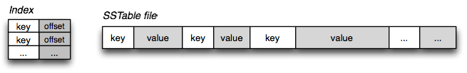
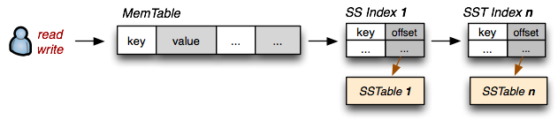
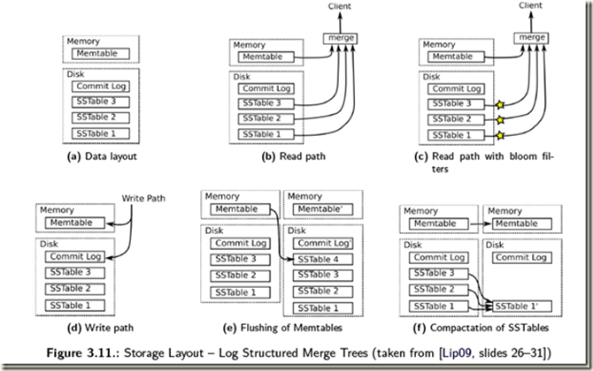

#### SQL
```shell
+---------+---------+---------------------+--------------+
| park_id | planet  | time                | #_foodships  |
+---------+---------+---------------------+--------------+
|       1 | Earth   | 1429185600000000000 |            0 |
|       1 | Earth   | 1429185601000000000 |            3 |
|       1 | Earth   | 1429185602000000000 |           15 |
|       1 | Earth   | 1429185603000000000 |           15 |
|       2 | Saturn  | 1429185600000000000 |            5 |
|       2 | Saturn  | 1429185601000000000 |            9 |
|       2 | Saturn  | 1429185602000000000 |           10 |
|       2 | Saturn  | 1429185603000000000 |           14 |
|       3 | Jupiter | 1429185600000000000 |           20 |
|       3 | Jupiter | 1429185601000000000 |           21 |
|       3 | Jupiter | 1429185602000000000 |           21 |
|       3 | Jupiter | 1429185603000000000 |           20 |
|       4 | Saturn  | 1429185600000000000 |            5 |
|       4 | Saturn  | 1429185601000000000 |            5 |
|       4 | Saturn  | 1429185602000000000 |            6 |
|       4 | Saturn  | 1429185603000000000 |            5 |
+---------+---------+---------------------+--------------+
```
#### influxDB
```shell
name: foodships
tags: park_id=1, planet=Earth
time			               #_foodships
----			               ------------
2015-04-16T12:00:00Z	 0
2015-04-16T12:00:01Z	 3
2015-04-16T12:00:02Z	 15
2015-04-16T12:00:03Z	 15

name: foodships
tags: park_id=2, planet=Saturn
time			               #_foodships
----			               ------------
2015-04-16T12:00:00Z	 5
2015-04-16T12:00:01Z	 9
2015-04-16T12:00:02Z	 10
2015-04-16T12:00:03Z	 14

name: foodships
tags: park_id=3, planet=Jupiter
time			               #_foodships
----			               ------------
2015-04-16T12:00:00Z	 20
2015-04-16T12:00:01Z	 21
2015-04-16T12:00:02Z	 21
2015-04-16T12:00:03Z	 20

name: foodships
tags: park_id=4, planet=Saturn
time			               #_foodships
----			               ------------
2015-04-16T12:00:00Z	 5
2015-04-16T12:00:01Z	 5
2015-04-16T12:00:02Z	 6
2015-04-16T12:00:03Z	 5
```
#### InfluxDB is not CRUD
- 需要更新的话,请插入相同时间点的不同值
- 你不能删除,请在客户端过滤时间周期
- 你不能通过 tags-key 去删除 tags,只能通过tags-value

# InfluxDB storage engine
- Data is safely written to disk
- Queried data is returned complete and correct
- Data is accurate (first) and performant (second)
The storage engine includes the following components:
- Write Ahead Log (WAL)
- Cache
- Time-Structed Merge Tree (TSM)
- Time Series Index (TSI)

## Writing data from API to disk(写数据从API到磁盘)

> The storage engine handles data from the point an API write request is received through writing data to the physical disk. 
> Data is written to InfluxDB using line protocol sent via HTTP POST request to the /write endpoint.
> Batches of points are sent to InfluxDB, compressed, and written to a WAL for immediate durability. 
> Points are also written to an in-memory cache and become immediately queryable. 
> The in-memory cache is periodically written to disk in the form of TSM files.
> As TSM files accumulate, the storage engine combines(结合) and compacts(压缩) accumulated them into higher level TSM files.

#### Write Ahead Log (WAL)
The Write Ahead Log (WAL) retains InfluxDB data when the storage engine restarts. The WAL ensures data is durable in case of an unexpected failure.

When the storage engine receives a write request, the following steps occur:

1. The write request is appended to the end of the WAL file.
2. Data is written to disk using fsync().
3. The in-memory cache is updated.
4. When data is successfully written to disk, a response confirms the write request was successful.

When the storage engine restarts, the WAL file is read back into the in-memory database. InfluxDB then answers requests to the /read endpoint.

#### Cache
The cache is an in-memory copy of data points currently stored in the WAL. The cache:
- Organizes points by key (measurement, tag set, and unique field) Each field is stored in its own time-ordered range.
- Stores uncompressed data.
- Gets updates from the WAL each time the storage engine restarts. The cache is queried at runtime and merged with the data stored in TSM files.
#### Time-Structured Merge Tree (TSM)
To efficiently compact and store data, the storage engine groups field values by series key, and then orders those field values by time. (A series key is defined by measurement, tag key and value, and field key.)
把字段分成多个键,然后根据时间排序
The storage engine uses a Time-Structured Merge Tree (TSM) data format. TSM files store compressed series data in a columnar format. To improve efficiency, the storage engine only stores differences (or deltas) between values in a series. Column-oriented storage lets the engine read by series key and omit extraneous data.
存储引擎用TSM 数据结构,TSM使用的是压缩的列格式。为了提升性能,存储引擎只存储这些字段的差值.面向列式存储可以很方便的找到一系列的key和忽略一些数据

After fields are stored safely in TSM files, the WAL is truncated and the cache is cleared. The TSM compaction code is quite complex. However, the high-level goal is quite simple: organize values for a series together into long runs to best optimize compression and scanning queries.
在字段被存储到TSM文件中区后,chache 将被清理.TSM的压缩非常复杂.然而最高的目标是简单的.长期整理一系列值，以最佳地优化压缩和扫描查询
                                        
#### Time Series Index (TSI)
The new time series index (TSI) moves the index to files on disk that we memory map. 
This means that we let the operating system handle being the Least Recently Used (LRU) memory.
Much like the TSM engine for raw time series data we have a write-ahead log with an in-memory 
structure that gets merged at query time with the memory-mapped index. Background routines run
constantly to compact the index into larger and larger files to avoid having to do too many index 
merges at query time. Under the covers, we’re using techniques like Robin Hood Hashing to do fast 
index lookups and HyperLogLog++ to keep sketches of cardinality estimates. The latter will give us 
the ability to add things to the query languages like the SHOW CARDINALITY queries.

[Time-Series-Index-TSI-设计细节](https://leftjs.github.io/2018/09/20/Time-Series-Index-TSI-%E8%AE%BE%E8%AE%A1%E7%BB%86%E8%8A%82/)


## In-memory indexing and the Time-Structured Merge Tree (TSM)


#### TSM files
```shell
+--------+------------------------------------+-------------+--------------+
| Header |               Blocks               |    Index    |    Footer    |
|5 bytes |              N bytes               |   N bytes   |   4 bytes    |
+--------+------------------------------------+-------------+--------------+

+-------------------+
|      Header       |
+-------------------+
|  Magic  │ Version |
| 4 bytes │ 1 byte  |
+-------------------+


+--------------------------------------------------------------------+
│                           Blocks                                   │
+---------------------+-----------------------+----------------------+
|       Block 1       |        Block 2        |       Block N        |
+---------------------+-----------------------+----------------------+
|   CRC    |  Data    |    CRC    |   Data    |   CRC    |   Data    |
| 4 bytes  | N bytes  |  4 bytes  | N bytes   | 4 bytes  |  N bytes  |
+---------------------+-----------------------+----------------------+


+-----------------------------------------------------------------------------+
│                                   Index                                     │
+-----------------------------------------------------------------------------+
│ Key Len │   Key   │ Type │ Count │Min Time │Max Time │ Offset │  Size  │...│
│ 2 bytes │ N bytes │1 byte│2 bytes│ 8 bytes │ 8 bytes │8 bytes │4 bytes │   │
+-----------------------------------------------------------------------------+

+---------+
│ Footer  │
+---------+
│Index Ofs│
│ 8 bytes │
+---------+
The last section is the footer that stores the offset of the start of the index.
```
> The index is composed of a sequence of index entries ordered lexicographically by key and then by time
> 该 索引包含了 一系列的 键 以字符串排序 然后再按时间排序 
> The key includes the measurement name, tag set, and one field. Multiple fields per point creates multiple index entries in the TSM file.
> 该 键 包含了 测量的名字, tag set 含有一个`field` 字段 ,多个 字段 `field` 将会创建多个索引在TSM文件 
>  Each index entry starts with a key length and the key, followed by the block type (float, int, bool, string) and a count of the number of index block entries that follow for that key
> 每个索引以索引的长度开始,紧跟着的是块的类型,然后是一个对应着这个key的块实例的计数器,
> Each index block entry is composed of the min and max time for the block, the offset into the file where the block is located and the size of the block. 
> 每一个索引块实例包含了 最小与最大时间对应这个块,还有对应 文件的块的偏移量.
> There is one index block entry for each block in the TSM file that contains the key.
> TSM文件中每个包含关键字的块都有一个索引块条目。
> The index structure can provide efficient access to all blocks as well as the ability to determine the cost associated with accessing a given key.
> 这个索引结构能够提供高效的的访问和确定给点键的花费的能力.
> Given a key and timestamp, we can determine whether a file contains the block for that timestamp. 
> 给定一个key和时间戳,我们能够很快的一个文件是否包含这个block和这个这个时间戳
> We can also determine where that block resides and how much data must be read to retrieve the block. Knowing the size of the block, we can efficiently provision our IO statements.
> 我们也能都确定该block 里面有多少数据应该必须被读. 知道这个block的尺寸,我们能够高效的完成IO操作.


#### 原理 SSTable （Sorted Strings Table) 然后是 LSM Tree
1. SSTable 用来干什么的呢?
> 这个结构和普通的key-value pairs的区别, 可以support range query和random r/w
    1. 结构特点是 根据 `key` 排序.
    2. 排序后的数据都是支持随机读的


如何应用这种数据结构呢?
1. WAL 日志先落盘后再返回给客户端.因为日志是顺序写的,所以很快.
2. 

1. On-disk SSTable indexes are always loaded into memory
2. All writes go directly to the MemTable index
3. Reads check the MemTable first and then the SSTable indexes
4. Periodically, the MemTable is flushed to disk as an SSTable
5. Periodically, on-disk SSTables are "collapsed together"




[LevelDB 解读](https://blog.csdn.net/anderscloud/article/details/7182165)

[SSTable and Log Structured Storage: LevelDB](https://www.igvita.com/2012/02/06/sstable-and-log-structured-storage-leveldb/)

[SSTable](https://www.cnblogs.com/fxjwind/archive/2012/08/14/2638371.html)

#### influxDB 设计时候的考虑 tradeoffs
